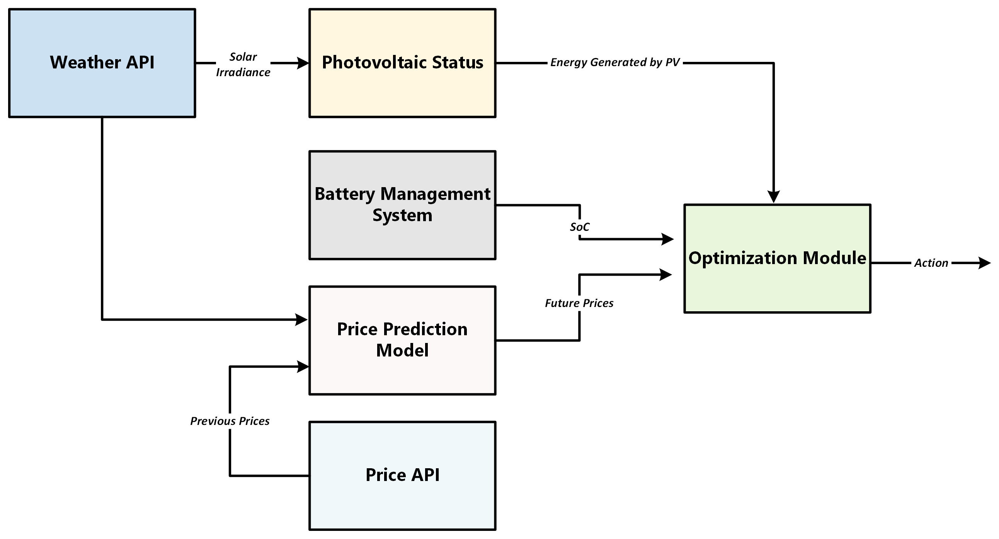

# Operational Recommendation System

---

## 1. Introduction

This User Manual provides an overview of the application and usage of an Operational Recommendation System (ORS), a software application designed to generate daily operating schedules for a grid-scale Battery Energy Storage System (BESS) linked with a photovoltaic (PV) solar installation. The system forecasts solar generation and electricity market prices in the UK intraday electricity market for the next 24 hours and determines how the BESS should operate to maximize revenue from market participation.

The intraday market allows electricity to be traded continuously as updated information on demand and renewable generation becomes available. In this context, the ORS evaluates expected price movements and solar generation forecasts to determine when energy should be stored in the battery or sold to the grid.

The ORS operates as a modular pipeline that integrates weather and market price data APIs, electricity price predictions, and a physics-based battery model. These inputs are combined within an optimization framework that calculates the most profitable operational strategy over the forecast horizon.

This manual provides instructions for installing, configuring, and running the pipeline, as well as guidance on interpreting the outputs produced by the system. Definitions of technical terms used throughout the document can be found in the Glossary in Section 9.

---

## 1.1 General Purpose

The system aims to maximize revenue by determining when energy should be stored, discharged, or sold directly to the grid while respecting the operational constraints of the BESS, while also having flexibility for integrating varying configurations and parameters.

---

## 1.2 System Architecture

The ORS is designed in a modular manner that integrates external sources of data, predictive modules, BESS architecture parameters and constraints, and an optimization engine that generates the final 24-hour horizon recommendation output.

The physical implementation of the ORS considers the following:

- Energy produced by the PV installation can either be exported directly to the grid or stored in the battery system for later discharge.
- The BESS imports energy from the grid during periods of low electricity prices and exports it when prices are higher.
- This bidirectional energy exchange enables economic optimization of the system's operation.



*Figure 1: ORS High-level Architecture*

### 1.2.1 Weather API

This module fetches meteorological forecast data from the location of the ORS implementation. Weather data is obtained from the Open-Meteo API, which provides free and publicly accessible weather forecasts at high temporal resolution. The API supplies several meteorological variables relevant to solar power estimation, including:

- Global horizontal irradiance (GHI)
- Direct normal irradiance (DNI)
- Diffuse horizontal irradiance (DHI)
- Cloud cover
- Air temperature
- Wind speed

The Weather API module sends a request to the Open-Meteo service using the geographic coordinates of the installation and returns forecast data for the upcoming 24-hour period at hourly resolution.

### 1.2.2 Photovoltaic Status Module

Retrieves solar irradiance forecasts from the Open-Meteo API and converts them into a 15-minute photovoltaic (PV) generation profile using site-specific physical parameters.

The following formula is central to the module:

```
Energy(t) = G(t) × A × η × Δt
```

*Equation 1: PV Energy*

where `G(t)` is the solar irradiance at time `t` from the Weather API, `A` is the total panel surface area, `η` is the panel efficiency, and `Δt` is the time interval.

### 1.2.3 Price API

This module works as the external source of market price data feeding into the Price Prediction Module. The system retrieves market price data from the Elexon electricity market data services (BMRS API), which provides:

- Historical electricity prices
- Market settlement prices
- Generation and demand information
- System imbalance data

### 1.2.4 Price Prediction Module

The price prediction module forecasts electricity market prices over the optimization horizon using a trained machine learning model. Historical weather and market data are processed through an Extract Transform Load (ETL) pipeline to construct the features required for prediction. The resulting forecasts represent the expected market value of electricity during each interval.

### 1.2.5 Battery Management Module

This module is centred on the BESS constraints, and the shared physics model is defined here to be used across the pipeline. Prior to deployment, the user must supply the key battery parameters of the considered BESS, including rated power, energy capacity, charging and discharging efficiencies, auxiliary losses, and self-discharge rate. These parameters are loaded from a configuration file into the module.

The module implements the discrete-time energy balance equation which governs the battery state of charge, and supplies physical constants — efficiencies, capacity, and loss rates — to the optimizer. It also performs post-solve validation and detailed loss logging.

```
E(t) = E(t-1) + η_ch · P_ch · Δt - (P_dis · Δt) / η_dis - P_aux · Δt - E(t-1) · r_sd · Δt
```

*Equation 2: Battery Energy Balance*

### 1.2.6 Optimization Module

Receives the PV and price forecasts together with the battery configuration and solves a Mixed-Integer Linear Programme (MILP) to determine the optimal dispatch schedule, specifying for each 15-minute interval whether the battery should charge from the grid, store solar energy, or discharge to the grid.

---

## 2. System Requirements

### 2.1 Software Requirements

| Requirement | Version          |
|-------------|------------------|
| Python      | 3.11 or higher   |
| pip         | 23.0 or higher   |
| Git         | Any recent version |

### Python Packages

| Section / Implementation    | Python Packages                                      |
|-----------------------------|------------------------------------------------------|
| Data processing             | `pandas`, `numpy`                                    |
| Machine learning model      | `lightgbm`, `scikit-learn`, `skforecast`             |
| Weather API client          | `openmeteo-requests`, `requests-cache`, `retry-requests` |
| Optimisation framework      | `pyomo`                                              |
| MILP solver                 | `highspy`                                            |
| UK public holiday calendar  | `holidays`                                           |

> **Note:** An internet connection is required to fetch live data from the Open-Meteo and BMRS/Elexon APIs during normal operation.

### 2.2 Environment Setup

The system requires a Python virtual environment to isolate its dependencies from other projects. All commands in this manual assume the virtual environment is active.

---

## 3. Installation

### 3.1 Setup

Clone the repository to your local machine and navigate to the project root directory:

```bash
git clone https://cseegit.essex.ac.uk/25-26-ce903-sp/25-26_CE903-SP_team03.git
cd 25-26_CE903-SP_team03
```

### 3.2 Virtual Environment Setup

Create and activate a Python virtual environment:

```bash
# Create the virtual environment
python -m venv .venv

# Activate on Windows
.venv\Scripts\activate

# Activate on Linux / macOS
source .venv/bin/activate
```

The command prompt will update to show the virtual environment name when it is active. All subsequent commands should be run with the environment active.

### 3.3 Dependency Installation

Install all required packages using the project configuration file:

```bash
pip install -e .
```

This installs the project in editable mode along with all dependencies declared in `pyproject.toml`.

To verify the installation, run:

```bash
python -c "import ors; print('Installation successful')"
```

---

## 4. Configuration

### 4.1 Complete Pipeline Configuration

The full system configuration can be expressed as a single JSON document covering the PV installation, battery parameters, optimisation settings, and output preferences. The example below shows all available options:

```json
{
  "config_name": "Example Optimization - Solar + Battery",
  "created_by": "Your Name",
  "created_date": "2026-03-07",
  "notes": "Example configuration showing all available options",

  "pv": {
    "rated_power_kw": 1000.0,
    "max_export_kw": 800.0,
    "panel_area_m2": 5000.0,
    "panel_efficiency": 0.18,
    "generation_source": "forecast",
    "location_lat": 51.5074,
    "location_lon": -0.1278,
    "min_generation_kw": 0.0,
    "curtailment_supported": true
  },

  "battery": {
    "rated_power_mw": 100.0,
    "energy_capacity_mwh": 600.0,
    "min_soc_percent": 10.0,
    "max_soc_percent": 90.0,
    "max_cycles_per_day": 3,
    "charge_efficiency": 0.97,
    "discharge_efficiency": 0.97,
    "auxiliary_power_mw": 0.5,
    "self_discharge_rate_per_hour": 0.0005,
    "current_energy_mwh": 300.0,
    "current_power_mw": 0.0,
    "current_mode": "idle",
    "cycles_used_today": 0,
    "is_available": true
  },

  "optimization": {
    "optimization_date": "2026-03-08",
    "start_time": "00:00",
    "duration_hours": 24,
    "time_step_minutes": 15,
    "price_source": "forecast",
    "terminal_price_method": "average"
  },

  "output": {
    "output_csv_path": "results/optimization_results.csv",
    "detailed_log_path": "results/battery_detailed_log.csv",
    "include_summary": true,
    "include_recommendations": true,
    "verbose": false,
    "currency": "GBP",
    "energy_units": "MWh",
    "power_units": "MW"
  }
}
```

The sections below document each module's configurable parameters in detail.

### 4.2 Battery Configuration

The physical parameters of the BESS are defined in:

```
src/ors/services/battery/battery_config.json
```

These parameters are loaded once at startup and shared across all modules. Modify this file to match the specification of the target installation before running the pipeline.

| Term       | Name                    | Parameter          | Description |
|------------|-------------------------|--------------------|-------------|
| P_rated    | Rated Power Capacity    | `p_rated_mw`       | Maximum charge and discharge power capability of the battery system |
| η_ch       | Charging Efficiency     | `eta_ch`           | Fraction of incoming electrical energy successfully stored during charging |
| η_dis      | Discharging Efficiency  | `eta_dis`          | Fraction of stored energy that can be delivered externally during discharge |
| a_aux      | Auxiliary Loss Coefficient | `a_aux`         | Proportion of rated power consumed by auxiliary systems (equivalent to 0.5 MW at 100 MW rated power) |
| r_sd       | Self-Discharge Rate     | `r_sd_per_hour`    | Fractional energy loss per hour due to natural internal leakage |
| E_duration | Energy Duration         | `e_duration_hours` | Maximum discharge time at rated power, implying an energy capacity of 300 MWh |
| E_min      | Minimum State of Charge | `e_min_frac`       | Lower operational energy limit to prevent over-discharge |
| E_max      | Maximum State of Charge | `e_max_frac`       | Upper operational energy limit to prevent overcharge |
| Δt         | Time Step               | `dt_hours`         | Timestep duration in hours (15-minute intervals) |
| —          | Bound Enforcement       | `enforce_bounds`   | Clamp energy state to operating limits at each step |

The energy capacity and operating bounds are derived automatically:

```
P_aux   = a_aux    × P_rated
E_cap   = P_rated  × E_duration
E_min   = e_min_frac × E_cap
E_max   = e_max_frac × E_cap
```

### 4.3 PV Configuration

The PV site parameters are defined in:

```
src/ors/config/pv_config.py
```

Two site configurations are pre-defined (`Site_Burst_1` and `Site_Burst_2`) and can be selected at runtime. To add a new site, create a new `PVSiteConfig` instance and register it in `PV_SITE_CONFIGS`.

| Parameter | Description | BURST_1 | BURST_2 |
|-----------|-------------|---------|---------|
| `pv_capacity_dc_mw` | DC capacity of the PV array (MW) | 65.0 | 130.0 |
| `pv_capacity_ac_mw` | AC capacity of the inverter (MW) | 50.0 | 100.0 |
| `dc_ac_ratio` | Ratio of DC to AC capacity | 1.3 | 1.3 |
| `module_efficiency` | PV module efficiency (0–1) | 0.21 | 0.21 |
| `inverter_efficiency` | Inverter conversion efficiency (0–1) | 0.985 | 0.985 |
| `performance_ratio` | Overall system performance ratio (0–1) | 0.82 | 0.82 |
| `degradation_per_year` | Annual output degradation rate (decimal) | 0.005 | 0.005 |
| `curtailment_threshold_mw` | Power level above which output is curtailed (MW) | 48.0 | 95.0 |
| `clipping_loss_factor` | Fraction of energy lost to inverter clipping (0–1) | 0.03 | 0.03 |
| `availability` | System availability factor (0–1) | 0.995 | 0.995 |
| `forced_outage_duration_h` | Expected forced outage duration per event (hours) | 1.0 | 1.0 |

All efficiency and ratio parameters must be in the range [0, 1]. The configuration is validated at load time and will raise a `ValueError` if any parameter is out of bounds.

## 5. Running the Pipeline

Run the full pipeline from the project root directory with the virtual environment active using a single command:

```bash
python run_optimization.py config_templates/example_full_config.json
```

This executes the PV forecast, price prediction, and optimisation steps in sequence using the parameters defined in the specified configuration file. Results are written to the output paths defined in the configuration and a summary is printed to the console.

---

## 6. Output Files

### 6.1 Dispatch Schedule

**File:** `data/optimizer_output.csv`

The primary output of the optimisation module. Each row represents one 15-minute interval in the 24-hour forecast horizon (96 rows total).

| Column        | Unit         | Description |
|---------------|--------------|-------------|
| `Timestamp`   | UTC datetime | Start of the 15-minute interval |
| `P_grid_MW`   | MW           | Power drawn from the grid to charge the battery |
| `P_dis_MW`    | MW           | Power discharged from the battery to the grid |
| `P_sol_bat_MW`| MW           | Solar generation routed into the battery |
| `P_sol_sell_MW`| MW          | Solar generation sold directly to the grid |
| `E_MWh`       | MWh          | Battery energy state at the end of the interval |
| `profit_step` | £            | Revenue generated during the interval |

At most one of `P_grid_MW`, `P_dis_MW`, and `P_sol_bat_MW` will be non-zero in any given interval, reflecting the mode exclusivity constraint.

### 6.2 Battery Log

**File:** `data/battery_log.csv`

A detailed energy audit produced by the Battery Management System module after the optimisation solve.

| Column                     | Unit | Description |
|----------------------------|------|-------------|
| `energy_before_mwh`        | MWh  | Battery energy state at start of interval |
| `energy_after_mwh`         | MWh  | Battery energy state at end of interval |
| `loss_charge_ineff_mwh`    | MWh  | Energy lost to charging inefficiency |
| `loss_discharge_ineff_mwh` | MWh  | Energy lost to discharging inefficiency |
| `loss_aux_mwh`             | MWh  | Energy consumed by auxiliary systems |
| `loss_self_discharge_mwh`  | MWh  | Energy lost to self-discharge |
| `total_loss_mwh`           | MWh  | Sum of all loss components |

### 6.3 Console Summary

After each optimisation run the following summary is printed to the terminal:

| Output | Description |
|--------|-------------|
| Total profit | Cumulative revenue over the 24-hour horizon (£) |
| Cycle count | Number of complete charge–discharge cycles (maximum 3) |
| Terminal energy | Battery state of charge at end of the horizon (MWh) |
| Terminal value | Value of residual stored energy based on the 30-day average price (£) |
| Energy balance validation | Maximum deviation between the optimiser's energy trajectory and the physics model |

**Example output:**

```
=== Optimisation Complete ===
Total profit:               £14,832.50
Cycles used:                2 / 3
Terminal energy:            87.3 MWh
Terminal value:             £ 2,104.80
Energy balance deviation:   0.000012 MWh  ✓
=============================
Results written to: data/optimizer_output.csv
Battery log written to: data/battery_log.csv
```

The energy balance deviation should be small (< 0.001 MWh). A large deviation indicates a mismatch between the optimiser's energy trajectory and the physics model and should be investigated before acting on the schedule.

---

## 7. Operational Constraints and Model Behaviour

The optimisation model enforces the following constraints at every 15-minute timestep:

- **Mode exclusivity:** the battery can operate in at most one mode per interval: grid charging, solar-to-battery charging, or discharging.
- **Power limits:** charging and discharging power are bounded by the rated capacity (`p_rated_mw`).
- **Energy bounds:** the battery state of charge is constrained to remain between `E_min` and `E_max` at all times.
- **Energy balance:** the battery energy state at each timestep is governed by the discrete-time physics equation enforced as a hard constraint.
- **Cycle limit** a maximum of three complete charge–discharge cycles per day is permitted to limit battery degradation.
- **Solar balance:** all solar generation at each timestep must be fully allocated to either battery storage or direct grid sale.

---

## 8. Troubleshooting

| Issue | Likely Cause | Resolution |
|-------|--------------|------------|
| `ModuleNotFoundError` | Running with system Python instead of the virtual environment | Activate the virtual environment before running |
| `FileNotFoundError: model.pkl` | Model file missing or path incorrect | Verify the file exists at `models/price_prediction/model.pkl` or use `--model <path>` |
| `No forecast rows found` | `--date` value falls outside the range of available data | Use a datetime within the training data range or run without `--date` for live mode |
| Optimizer returns no solution | Required solver not installed | Install HiGHS with `pip install highspy` or install GLPK as an alternative |
| Price predictions differ from training | Expected when using live APIs | Use `--use-csv` to reproduce training predictions exactly |
| API request fails or times out | No internet connection or external API unavailable | Check network connectivity |
| `ValueError` on battery config load | Invalid or missing parameter in `battery_config.json` | Check all required fields are present and within valid ranges |

---

## 9. Code Quality

The project enforces formatting (Black), linting (Ruff), and type checking (mypy) across all source code.

```bash
make format     # Auto-format with Black
make lint       # Lint with Ruff
make typecheck  # Type-check with mypy
make ci         # Run all checks (same as CI pipeline)
```

---

## 10. Glossary

**Auxiliary power** — Power consumed by supporting battery systems such as cooling, monitoring, and control electronics during operation. This consumption reduces the net energy available for charging or discharging.

**Battery Energy Storage System (BESS)** — A system that stores electrical energy in rechargeable batteries and releases it when required. In the ORS, the BESS stores energy from either solar generation or the grid and discharges it when electricity prices are favourable.

**Charging efficiency (η_ch)** — The fraction of electrical energy supplied to the battery during charging that is successfully stored as usable energy. Losses occur due to internal resistance and system inefficiencies.

**Cycle** — One complete charge and discharge of the battery. A full cycle occurs when the battery is charged and then discharged by an amount equal to its usable capacity.

**Discharging efficiency (η_dis)** — The fraction of stored battery energy that can be delivered to the grid during discharge. Losses occur due to internal resistance and conversion inefficiencies.

**Dispatch schedule** — The time series output of the optimization model specifying how the battery and solar generation should operate at each timestep, including charging, discharging, and energy allocation.

**Energy capacity (E_cap)** — The maximum amount of energy that the battery can store, typically measured in megawatt-hours (MWh). It is determined by the battery's rated power and duration.

**Energy state (E_t)** — The amount of energy stored in the battery at timestep t. This value changes depending on charging, discharging, and system losses.

**ETL (Extract, Transform, Load)** — A data processing pipeline used to collect raw data from external sources, transform it into a structured format suitable for modelling, and load it into the system for analysis or prediction.

**HiGHS / GLPK / CBC** — Optimization solvers capable of solving linear and mixed-integer programming problems. These solvers are used to compute the optimal battery dispatch schedule.

**Horizon** — The time window over which forecasts and optimization are performed. In the ORS, the optimization horizon is typically 24 hours.

**MILP (Mixed-Integer Linear Programme)** — A mathematical optimization model that includes both continuous variables (such as power flows) and integer variables (such as operating modes). The ORS uses MILP to determine the optimal dispatch schedule.

**Mode exclusivity** — A constraint in the optimization model ensuring that only one battery operating mode (charging, discharging, or idle) can occur at a given timestep.

**Open-Meteo** — A public weather data API used by the ORS to obtain solar irradiance and other meteorological data required for photovoltaic generation forecasting.

**Operating mode** — The current state of the battery system during a timestep, such as charging from the grid, charging from solar generation, discharging to the grid, or remaining idle.

**PV (Photovoltaic)** — Technology that converts sunlight directly into electricity using solar panels.

**Self-discharge** — The gradual loss of stored battery energy over time even when the battery is not actively charging or discharging.

**State of charge (SoC)** — The proportion of energy currently stored in the battery relative to its total capacity, usually expressed as a percentage.

**Terminal value** — The assumed economic value of the energy remaining in the battery at the end of the optimization horizon. This prevents the optimizer from fully discharging the battery if that energy may have future value.

**Timestep (Δt)** — The discrete time interval used in the optimization model. In the ORS, each timestep represents a 15-minute period.

**LightGBM** — A gradient boosting framework used to generate electricity price predictions in the ORS. It supports parallelisation and efficient training of tree-based algorithms on large datasets.

**Skforecast** — A Python library that wraps scikit-learn-compatible models into time series forecasters, enabling consistent feature engineering and model evaluation across the forecasting pipeline.

**30-day average price (p̄₃₀)** — The average electricity market price over the previous 30 days. This value is used to estimate the terminal value of energy remaining in the battery at the end of the optimization horizon.
