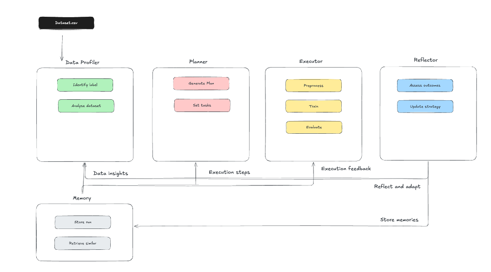

# Deliverable 1: Data Exploration and Planning

The aim of this deliverable is to demonstrate an understanding of any dataset and my readiness to design an agentic data science system. The `eda.ipynb` does this in six steps:
1. Data loading and basic inspection
2. Exploratory data analysis (EDA) quality
3. Data cleaning and preprocessing decisions 
4. Dataset understanding and challenge identification 
5. Agentic planning proposal for the final project 
6. Creation of a summary `report.md` report and a `eda_summary.json` file

This script will form the basis for the final Agentic Data Scientist. The code will be added to the existing skeleton structure, while the Plan will guide the creation of the remaining elements for the Agent.

The remaining sections of this document will detail and explain the steps taken in the notebook.

## 1. Data Loading and Basic Inspection
In a first step, the agent loads the data, and performs basic inspection on it. Basic inspection includes feature type, label, and ID column detection, as well as an initial datasize assessment.

### 1.1 File loading 
The agent reads the file into a pandas DataFrame, as this facilitates the inspection and editing of the data.

### 1.2 Ensure Variable Type Consistency
Before detecting each variables feature type, the agent checks each object-type column for mixed types (e.g. a column containing both strings and numbers). If the majority of values are numeric, the column is converted to numeric and the non-numeric entries become NaN. Otherwise, the column is kept as string.

### 1.3 Feature type detection
The agent classifies each column as one of: `bool`, `numeric`, `datetime`, `text`, or `categorical`.
* Numeric covers all integer and float subtypes. The agent groups these types as they are cleaned and preprocessed in the same way. 
* Since datetime columns may not be in datetime format, the agent tests object columns for datetime parseability. If more than 80% of the values are parseable, the column is classified and converted to datetime. This percentage is arbitrary, and can be adjusted by the "Reflector" if needed.
* Object columns are split into text vs. categorical. If more than 5% of the values are unique and there are more than 10 unique values, the column is classified as text. This percentage is arbitrary, and can be adjusted by the "Reflector" if needed.

### 1.4 Detect target column
The agent determines whether the dataset contains ground truth labels. The agent determines a list of possible labels, based on whether they meet the following three criteria:
* **Exact name match** - If a single column matches any of the following labels, it is considered the target column: `["target", "label", "class", "y", "outcome"]`. If multiple columns match this criterion, the agent will do the following steps ONLY for these columns.
* **Disqualify** - The agent disqualifies columns that are of datetime or text format, as well as columns that contain hint words: `["id", "name", "date", "time", "timestamp", "index", "path", "file", "description", "comment", "note", "address", "phone", "email", "code", "key", "uuid"]`. These are words that - in my experience - are not used as labels. It is an assumption, and can be adjusted by the "Reflector" if needed. Additionally, categorical columns with less than 2 or more than 20 unique values are disqualified, as they are unlikely to be meaningful classification targets.
* **Score** - Remaining candidates are scored using semantic similarity, keyword bonuses, and position. The semantic similarity is calculated using a pre-trained 300-dimensional spaCy model (en_core_web_md) and compares the semantic similarity of each column-name token to each token parsed from the dataset filename. The keyword bonuses are given for the following keywords: `["data", "final", "result", "output", "response", "prediction"]`. The position bonus is given for the last column, since excel sheets tend to be organised as such. 

If any column has a score above 1.5, then the agent assumes that the highest scoring column is the target column. If no column has a score above 1.5, then the agent assumes that the dataset does not contain a target column. This threshold can be adjusted by the "Reflector" if needed.

If the agent identifies a target, it decides whether the task is a regression or classification task. If the target type is an object/category (categorical strings), OR numeric with <= 20 unique values (discrete classes), then the task is a classification task. If the target is numeric with > 20 unique values (continuous), then the task is a regression task. This threshold can be adjusted by the "Reflector" if needed.

### 1.5 Identifying ID column
The agent detects and drops columns that serve as row identifiers (e.g. names containing "id", "index", or "idx", or columns with sequential integer values). These carry no predictive information.

### 1.6 Determine dataset size
The agent flags small datasets (<1,000 rows) and high-dimensional datasets (>40 columns), as both require adjusted modelling strategies.

## 2. Exploratory Data Analysis
This section explores the data before conducting any data cleaning. The type of EDA depends largely on whether a target has been found (supervised learning), and whether the target is categorical or numeric:
* If supervised learning and classification task:
    * Class imbalance detection
    * Grouped countplot
    * Feature importance
* If supervised learning and regression task:
    * Countplot
    * Feature importance
* If unsupervised learning:
    * Countplot
* For any numeric feature:
    * Boxplot
    * Histogram
    * Correlation heatmap
* For any categorical feature:
    * Countplot

### 2.1 Class imbalance detection (classification only)
The agent checks whether the target classes are balanced and computes the imbalance ratio. If the imbalance ratio is above 3, the agent will flag the dataset as imbalanced. This has implications on the later modelling plans.

### 2.2 Boxplots (numeric features only)
The agent generates boxplots for each numeric feature to visualise the spread. It also flags potential outliers for later removal.

### 2.3 Histograms (numeric features only)
The agent generates histograms for each numeric feature to visualise the distribution.

### 2.4 Correlation heatmap and feature importance (numeric features only)
The agent generates a correlation heatmap for each numeric feature to visualise the correlation between features. If any two feature have a correlation coefficient above 0.90 in absolute value, then the agent will flag the dataset as having multicollinearity. This threshold can be adjusted by the "Reflector" if needed.
If a target was identified, then the agent ranks the importance of each numeric feature for the target.

### 2.5 Countplots (categorical features only)
If a categorical target was identified, the agent creates stacked countplots grouped by class. Otherwise, it creates a simple countplot for each categorical feature.

### 2.6 Summary statistics
The agent computes summary statistics for both numeric and categorical features - easily visualised in a table. The statistics include: ['mean', 'median', 'std', 'min', 'max', 'q1', 'q3', 'skewness', 'is_skewed', 'kurtosis', 'is_kurtosis'] - which once more highlights any non-normality and outliers.

## 3. Data cleaning and preprocessing
The agent prepares the data for model training. All cleaning steps up to §3.6 operate on the full `df`. After the train/test split (§3.7), remaining transformations are fit on training data only. This is to prevent any data leakage.

### 3.1 Remove single-variable columns
Single-variable columns provide no predictive information. The agent removes these.

### 3.2 Multicollinearity handling
If multicollinear pairs were flagged in section 2.4, the agent resolves them by dropping redundant features. It first builds an adjacency graph from all flagged pairs and identifies connected components (groups of mutually correlated features).

* Groups of 3+ features: The agent keeps the feature with the highest variance and drops the rest. Variance is used as the selection criterion because it indicates information spread across observations.
* Pairs (groups of 2): If a numeric target exists, the agent keeps the feature with the stronger absolute correlation to the target, as it carries more predictive signal. If both features have equal target correlation, it falls back to variance. If no numeric target is available (unsupervised or categorical target), variance is used directly.

All dropped columns are recorded, and the surviving numeric column list is updated accordingly.

### 3.3 Datetime conversion
Models cannot consume raw datetime values. The agent decomposes each into numeric components (year, month, day, day-of-week) and drops the original column.

### 3.4 LabelEncode target
If there is a target, and it is categorical, the agent label encodes it. This is necessary for the model to consume it.

### 3.5 Remove or address missing variables

The agent computes the percentage of missing values per column, tests whether missingness is systematic (MAR/MNAR) or random (MCAR), and then applies the appropriate imputation or removal strategy:
* **Missing Completely at Random (MCAR).** This type of missing value is unrelated to any variable, which means the agent can delete the row with missing values without biasing the model if there is sufficient data.   
* **Missing at Random (MAR).** Variables that are MAR depend on other observed variables, which means that if all rows with missing values were to be deleted, it would bias the results.
* **Missing Not at Random (MNAR).** Variables that are MNAR are dependent on themselves, which once more would bias the results if deleted. However, these are tricky to detect. The agent therefore flags that the dataset could have MNAR variables when addressing missing values.

The agent is designed to prefer deletion over imputation when feasible, as this introduces no artificial data, preserving the true distribution. It handles missing values using the following decision logic:

1. **>40% missing** — drop the column entirely, since this provides too little information to reliably impute.
2. **Assess missingness type** — test whether the missing pattern is systematic (MAR) or random (MCAR) based on the Mann Whitney U test (for numeric variables) or Chi-square test (for categorical variables). If more than 25% of the tested columns are significant at a standard 5% level, then the agent considers the missingness systematic. Otherwise, it is considered random.
3. **Random <10% + dataset >= 50 rows** — drop the affected rows, since this should not bias the model or remove too much information from it.
4. **Categorical column** — impute with the mode (most frequent value).
5. **Numeric + symmetric** — impute with the mean.
6. **Numeric + skewed** — impute with the median.

### 3.6 Remove duplicates
The agent removes exact duplicate rows and duplicate columns (identical content under different names) to avoid redundancy in the training data.

### 3.7 Train/test split
The agent splits the data into training and testing sets using a random split, with a default test size of 30%. From here on, the agent only uses the training set to fit models and the testing set to evaluate them to avoid any data leakage.

### 3.8 Remove outliers
The agent removes outliers from the training data based on the interquartile range (IQR). This test was chosen over a z-score test for its robustness on skewed distributions. 

### 3.9 Categorical encoding
The agent encodes the categorical features for the model to consume it. The strategy depends on the number of unique values in each column:
* **2 unique values** — binary label encoding (0/1).
* **3-5 unique values** — one-hot encoding (drop-first to avoid multicollinearity).
* **>5 unique values** — target-encode or ordinal-encode.

All encoders are fit on training data only and applied to both train and test.

### 3.10 Normality testing, log transformation and numeric scaling
For each numeric feature column, the agent conducts the following tests and transformations (excluding target and booleans): 
The feature is first tested for normality (if more than 20 values, since otherwise it is not reliable), using a D'Agostino-Pearson test to a N(0,1) distribution where the alpha is adjusted to the size of the dataset: If the agent faces less than 500 rows, it uses a standard alpha = 0.05. If there are between 500 to 5000, then a more liberal alpha = 0.01 is applied, and finally, if there are over 5000 rows, an alpha = 0.001 is applied. Any feature that passes the normality test can be scaled using StandardScaler. If the feature does not pass the normality test, the agent checks whether it is skewed at an absolute degree of > 0.5. If so, the agent applies a log transformation, and then rechecks for normality. For the log transformation, the agent ensures all values are positive, and then applies the log transformation. The log transformation is applied to the training and test data, but based on the training set only. This means that the test set could have values more negative than the training set, in which case, the transformation results in NaN values, which are flagged. If the feature is still not normal, the agent applies a MinMaxScaler(−1, 1) to ensure higher predictability in the transformed non-normal data, and models benefit from features that have all been scaled similarily.

### 3.11 Dimensionality reduction
The agent applies PCA-based dimensionality reduction if the number of features exceeds 1/2 of the number of rows. The statistical literature on high-dimensional inference generally identifies the problematic regime as p approaching n. The Marchenko-Pastur law from random matrix theory shows that sample covariance matrices become unreliable estimators as p/n approaches 1. A threshold of n/2 is a pragmatic early-warning trigger that catches genuinely high-dimensional problems without aggressively reducing feature spaces that are perfectly manageable. The agent builds a PCA model such that the components that remain still explain at least 95% of the variance. The agent then applies the PCA model to both the training and test data. 

## 4. Plan

This section sets out the plan for an offline Agentic Data Scientist, which will be implemented for Deliverable 2 of this class. 

### 4.1 System Architecture Overview

## 4.2 Description of components

#### 4.2.1 Data Profiler (`tools/data_profiler.py`)

**Inputs**
The data profiler takes the raw CSV file as input. If the memory already has relevant memories, it additionally takes memories from similar past datasets to aid this workflow.

**Steps:**
The reasoning below is based on the functions that are already defined (or described) in `eda.ipynb`. We add more functionality to this initial step than in the notebook so that the agent has complete information before triggering the planning component.

* If the file loads successfully:
    * infer_schema() _generates report_data["feature_type"]_
    * detect_target() _generates report_data["target"], report_data["task_type"]_
    * detect_id_columns() _drop non-informative columns_
    * compute_summary_stats() _generates report_data["summary_statistics"]_
    * detect_missingness() _generates report_data["missingness_pct"], report_data["systematic_missingness"]_
    * plot_boxplots() _generates report_data["boxplot_outlier_cols"] and report_data["boxplot_skewed_cols"]_    
    * detect_multicollinearity() _generates report_data["multicollinear_pairs"]_
    * assess_dimensionality() _generates report_data["dimensionality_reduction"]_

    * If the problem is a supervised classification, then the agent runs detect_class_imbalance() _generates report_data["imbalance_ratio"]_
    * If the problem is supervised (classification or regression), then the agent runs compute_feature_importance_mi() _generates report_data["feature_importance_mi"]_

* Otherwise, the agent triggers an error which stops the workflow.

**Output:** exports `eda_summary.json` and populates `report_data` dict (Sections 1–3 of this notebook).

**Checks that Reflector will do:** the Reflector (once triggered) checks whether the outputs were all complete:
* All expected keys need to be present in `report_data`
* Task needs to either be `{"classification", "regression", None}`
* `n_rows` and `initial_n_cols` need to be positive integers

If any check fails, the Reflector retriggers the Data Profiler.

### 4.2 Planner (`agents/planner.py`)

**Inputs**
The planner receives the `eda_summary.json`, which contains all report_data information, alongside any relevant memories.

**Steps**
The Planner reads `eda_summary.json` and generates a plan based on the steps below:

#### A. Task choices

The agent checks whether the task_type is a `classification`, `regression`, or `unsupervised` problem.

* Classification
    * candidate_metrics  = ["accuracy", "f1", "precision", "recall", "roc_auc"]
    * cv_strategy        = StratifiedKFold(n_splits=5)
    * model_pool         = select_classification_models(report_data)

* Regression
    * candidate_metrics  = ["mse", "rmse", "r2"]
    * cv_strategy        = KFold(n_splits=5)
    * model_pool         = select_regression_models(report_data)

* Unsupervised
    * candidate_metrics  = ["silhouette_score", "completeness_score"]
    * cv_strategy        = None
    * model_pool         = select_clustering_models(report_data)

#### B. Model selection decision tree

The model selection is based on the task_type, dataset size, dimensionality, multicollinearity, and class imbalance.

##### Classification

| Task | Condition(s) | Choice | Justification |
|------|-------------|--------|---------------|
| Classification | Always (baseline) | Include `DummyClassifier` as baseline | Measures random performance on dataset |
| Classification | Dataset size < 500 rows | `base_models = [DummyClassifier, LDA, DecisionTreeClassifier]` | LDA is a linear classifier with few parameters, suitable for small samples. DecisionTreeClassifier is a simple baseline that requires no distributional assumptions |
| Classification | Dataset size 500–5,000 rows | `base_models = [DummyClassifier, LDA, DecisionTreeClassifier, RandomForestClassifier, SVC]` | We still keep the simpler methods as baselines, and add models that have a higher parameter count and thus require more data to perform well. |
| Classification | Dataset size > 5,000 rows | `base_models = [DummyClassifier, RandomForestClassifier, SVC]` | With very large datasets, we only keep the most performant models as simpler models are likely going to underfit.|
| Classification | High dimensionality | Remove SVC from `base_models`| SVC does not do well with high dimensionality datasets. |
| Classification | Significant class imbalance | Add SMOTE to the preprocessing plan; set `primary_metric = 'f1'` | F1 accounts for both precision and recall, which is essential when the class distribution is skewed. SMOTE balances the classes with data resampling |
| Classification | No significant class imbalance | Set `primary_metric = 'accuracy'` | When no significant class imbalance exists, we can use accuracy |

##### Regression

| Task | Condition(s) | Choice | Justification |
|------|-------------|--------|---------------|
| Regression | Always (baseline) | Include `DummyRegressor` as baseline | Measures random performance on dataset |
| Regression | Dataset size < 500 rows | `base_models = [DummyRegressor, Ridge, Lasso, ElasticNet]` | Small datasets risk overfitting thus we regularise linear models. Ridge handles correlated features (L2); Lasso performs feature selection (L1); Elastic Net balances both methods. |
| Regression | Dataset size 500–5,000 rows | `base_models = [DummyRegressor, Ridge, Lasso, DecisionTreeRegressor]` | Medium data supports a tree-based model. |
| Regression | Dataset size > 5,000 rows | `base_models = [DummyRegressor, Ridge, DecisionTreeRegressor, RandomForestRegressor]` | Larger datasets support methods with more parameters. RandomForestRegressor reduces variance through bagging of decision trees. Ridge retained as a stable linear baseline. |
| Regression | Significant target skewness | Prioritise tree-based models (DecisionTreeRegressor, RandomForestRegressor) | Tree-based models do better in skewed datasets. |
| Regression | No significant target skewness | Prioritise linear models (Ridge, Lasso, ElasticNet) | When the target is approximately symmetric, do the simpler implementation. |
| Regression | Multicollinear features detected | Prioritise Ridge; set `primary_metric = 'r2'` | R2 measure the proportion of variance explained. Ridge (L2) shrinks correlated coefficients proportionally, stabilising estimates. |
| Regression | Many irrelevant features detected | Prioritise Lasso | Lasso (L1) sets irrelevant coefficients exactly to zero |
| Regression | Default primary metric (no special condition) | Set `primary_metric = 'rmse'` | Use simple methods, when possible |

##### Unsupervised

| Task | Condition(s) | Choice | Justification |
|------|-------------|--------|---------------|
| Unsupervised | Default (no labels available) | `base_models = [KMeans, DBSCAN]` | Both KMeans and DBSCAN are simple unsupervised clustering methods. |
| Unsupervised | High dimensionality flagged | Add PCA step (retain ≥ 95% variance) before clustering | High-dimensional data causes overfitting. |
| Unsupervised | Selecting k for KMeans | Use elbow method + silhouette analysis | Elbow method plots WCSS vs k to find diminishing returns. |
| Unsupervised | All unsupervised tasks | Set `primary_metric = 'silhouette_score'` | Silhouette score is an internal metric requiring no true labels |
| Unsupervised | Ground-truth labels available for evaluation | Also compute `completeness_score` | Completeness measures whether all points of the same true class are assigned to the same cluster. Only usable when labels exist for benchmarking. |

#### C. Preprocessing plan (adapts to EDA findings)

The Planner develops a preprocessing plan based on `eda_summary.json`. All transformations are **fit only on the training data, but applied to both the train and test data** to prevent data leakage.

| Step | Condition(s) | Choice | Justification |
|------|-------------|--------|---------------|
| Missing values | Column has > 40% missing | Drop columns | Columns with too many NaNs are dropped. |
| Missing values | Missingness assessed as random (MCAR via Mann-Whitney U / χ² tests), < 10% of rows affected, and dataset retains ≥ 50 rows after removal | Drop rows | When missingness is completely random and few rows are affected, dropping the rows isn't an issue and is the cleanest method. |
| Missing values | Categorical column with remaining missingness | Replace with mode | The mode is the logic replacement for NaN in categorical data |
| Missing values | Numeric column, distribution is symmetric (not skewed) | Replace with mean| A replacement with the mean is the simplest replacement in symmetric datasets|
| Missing values | Numeric column, distribution is skewed | Replace with median| A replacement with the median is the simplest replacement in skewed datasets|
| Outliers | Columns flagged with IQR outliers during boxplot analysis | remove outliers from the training set only | Outlier removal prevents extreme values from distorting the model|
| Skewness | Numeric column fails D'Agostino–Pearson normality test and is skewed (`|skew| > 0.5`) | Log transformation (with shift if necessary) and re-test normality | Log transformation reduces skew |
| Scaling | Numeric column passes D'Agostino–Pearson normality test (adaptive α: 0.05 for n ≤ 500, 0.01 for n ≤ 5000, 0.001 for n > 5000) | StandardScale both the train and test - but only fit on train | Appropriate for normally distributed features |
| Scaling | Column still non-normal after log transformation, or non-normal but not skewed | MinMax scaling (-1, 1) both the train and test - but only fit on train | In this case we can't make normality assumptions, and thus stick to a MinMax scaling |
| Encoding | Target column (categorical) | LabelEncode - fit on full df before splitting into train and test | Converts class labels to integers |
| Encoding | Categorical feature, binary (`n_unique == 2`) | LabelEncode — fit on train, transform both | Map True/False to 1/0 |
| Encoding | Categorical feature, low cardinality (`3 ≤ n_unique ≤ 5`) | OneHotEncode — fit on train, transform both | Converts each category into a 0/1 column |
| Encoding | Categorical feature, high cardinality (`n_unique > 5`), supervised task | TargetEncode — fit on train with `y_train`, transform both | Encodes categories using the smoothed mean of the target |
| Encoding | Categorical feature, high cardinality (`n_unique > 5`), unsupervised task | OrdinalEncode — fit on train, transform both | Makes categories into integers when no target |
| Dimensionality | `n_features × 2 > n_rows_train` and ≥ 2 PCA-eligible columns | `PCA(n_components=0.95, fit="train_only")` | Reduces number of features when there are too many features in the dataset |

#### D. Cross-validation strategy
Whenever the task is a classification problem, the agent uses StratifiedKFold, otherwise it uses KFold.
The stratified k-fold allows hyperparameter tuning via nested cross-validation via GridSearchCV.

**Output:** the Planner produces a `plan.json` file, which is read by the Executor.

**Checks that Reflector will do:** the Reflector (once triggered) checks whether the outputs were all complete:
- Only valid tools should be called from `tools/`
- At least one model should be in `model_pool`
- The metric set should match the task type
- Preprocessing steps should be ordered correctly (missing, then outliers, then encoding, then scaling, then PCA)

---

#### 4.2.3 Action Executor (`agentic_data_scientist.py`, `tools/modelling.py`, `tools/evaluation.py`)

**Inputs:**
The Executor receives the `plan.json` from the Planner and the preprocessed train and test data set.

**Steps**
For each tool in the plan, the executor tries to execute it. It trains each model via nested cross-validation, and computes all metrics, exported as `metrics.json`

**Checks that Reflector will do:** the Reflector (once triggered) checks whether any errors occurred during execution. If so, it checks whether:
* It is an issue with the time allocated to run the model (in which case it allocates more time)
* It is an issue with the memory allocated to run the model (in which case it allocates more memory)
* It is an issue with the model parameters (in which case it retries with different parameters)
* It is an issue with the model (in which case it retries with a different model)

Furthermore, the Reflector will also check whether:
* All models converged
* Metric values are within plausible ranges (e.g., R² ∈ [-1, 1], RMSE ≥ 0)
* Any fold produced NaN metrics

#### 4.2.4 Reflector (`agents/reflector.py`)

**Inputs**
The reflector receives the `metrics.json` from the Executor, the `plan.json`, the `eda_summary.json`, and the iteration counter (how many times has the reflector been triggered).

**Steps**
The reflector will:
1. **Check whether any error occurred or any of the conditions weren't met** See earlier sections for errors and conditions
2. **Check whether the quality of the model is acceptable:** We want to ensure that a minimum quality level is reached (in terms of accuracy, precision, recall, F1-score, etc.). If the minimum quality is reached, the reflector stops the process and picks the best model. It then triggers the memory agent to store the memories.
3. **Check whether the maximum number of iterations has been reached:** If so, the reflector will stop the process and flag the model didn't succeed.

---
#### 4.2.5 Memory System (`agents/memory.py`)

**Inputs**
It takes as input all the completed run data: `eda_summary.json`, `plan.json`, `metrics.json`, `reflection.json`

**Output**
It stores information on the the dataset profile, the plan used, the best model and its metrics, the reflection notes and the timestamp in a json memory file.

**Retrieving memories**
For each new workflow, the memory system retrieves the most similar memory to the current dataset profile, based on a scoring system that ranks past workflows based on similarity (in terms of task type, number of rows, number of features, missing data, imbalance, etc.). It may not return any information. 

**How memory helps planning:**
When a memory hint is available, the Planner uses it to:
1. **Model selection:** the model that performed best on the similar dataset will be selected first.
2. **Better hyperparameter ranges:** grid search first focuses on parameters that worked well before.
3. **Better thresholds** If a certain threshold didn't perform well in the past, the memory remembers to use a different threshold
4. **Skip known failures:** If a specific model always does badly, it is excluded from the initial pool.