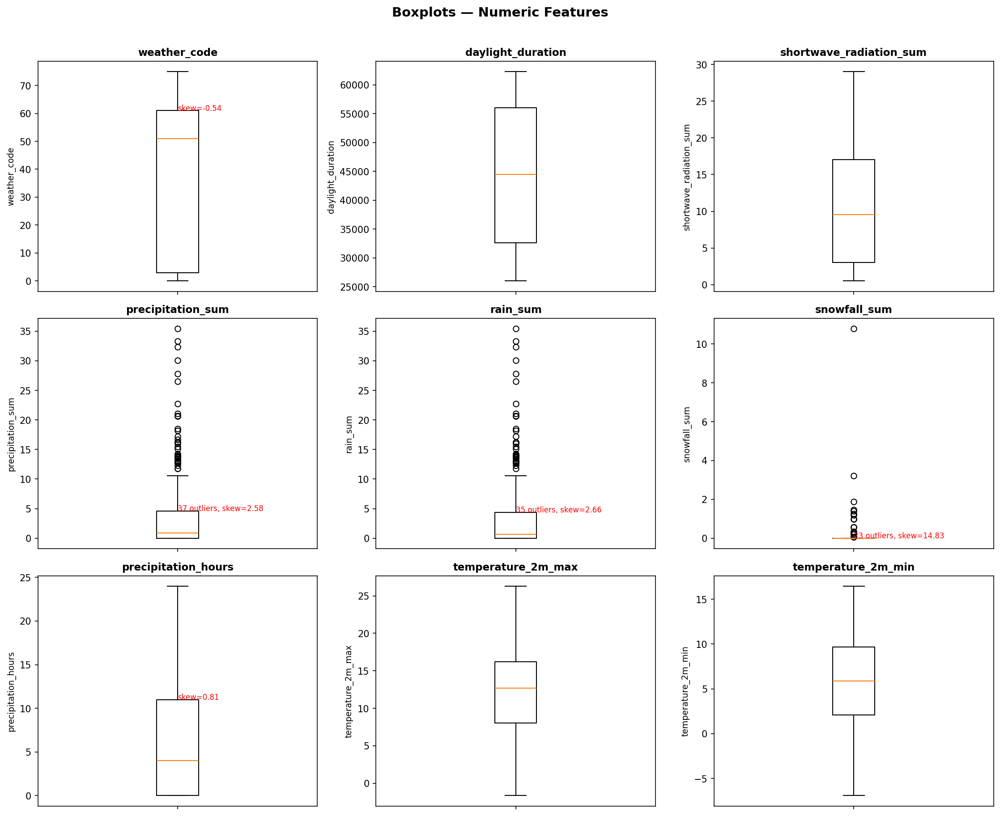
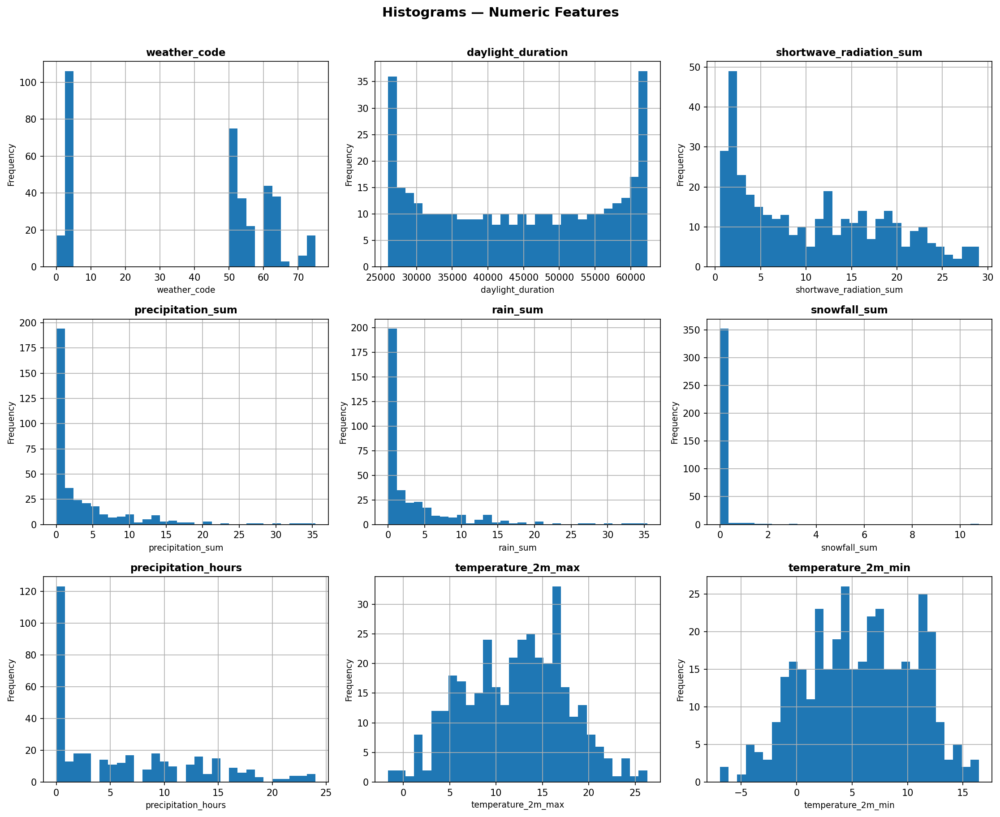
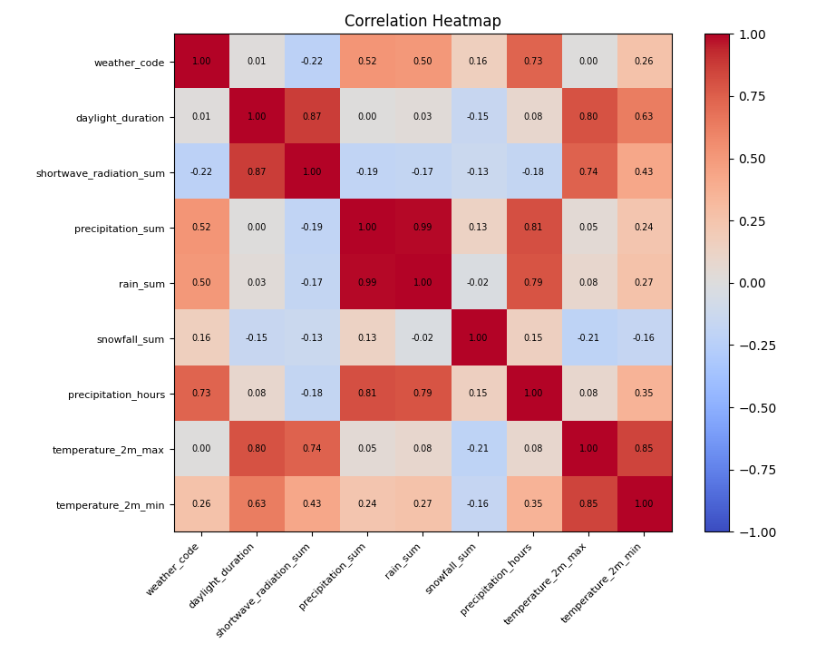

# Agentic Data Scientist Report

> **Dataset:** `../../tests/data/prediction/historical_daily_2025.csv`
> **Target:** `None`

---

## 1. Dataset Profile

| Property | Value |
|:--|:--|
| Rows | **365** |
| Initial columns | **12** |
| Final columns | **16** |
| Task | N/A |
| Learning | Unsupervised |
| Imbalance ratio | N/A |

### 1.1 Initial Feature Types

- **Boolean** (0): None
- **Numeric** (24): `weather_code`, `daylight_duration`, `shortwave_radiation_sum`, `precipitation_sum`, `snowfall_sum`, `precipitation_hours`, `temperature_2m_max`, `temperature_2m_min`, `date_utc_year`, `date_utc_month`, `date_utc_day`, `date_utc_dayofweek`, `sunrise_year`, `sunrise_month`, `sunrise_day`, `sunrise_dayofweek`, `sunrise_hour`, `sunrise_minute`, `sunset_year`, `sunset_month`, `sunset_day`, `sunset_dayofweek`, `sunset_hour`, `sunset_minute`
- **Date** (0): None
- **Text** (0): None
- **Categorical** (0): None

### 1.2 Final Feature Types

- **One-Hot Encoded** (0): None
- **Embedded** (0): None
- **Scaled** (16): `weather_code`, `daylight_duration`, `shortwave_radiation_sum`, `precipitation_sum`, `snowfall_sum`, `precipitation_hours`, `temperature_2m_max`, `temperature_2m_min`, `date_utc_year`, `date_utc_month`, `date_utc_day`, `date_utc_dayofweek`, `sunrise_hour`, `sunrise_minute`, `sunset_hour`, `sunset_minute`
- **Unchanged** (0): None

---

## 2. Data Quality

| Check | Result |
|:--|:--|
| Missing values | No missing values found. |
| Systematic missingness | No columns with missing data to assess |
| Skewed columns | `shortwave_radiation_sum`, `precipitation_sum`, `snowfall_sum`, `precipitation_hours` |
| Duplicates | 0 duplicate row(s), 8 duplicate column(s) found. |
| Outliers | IQR-based removal (training only): `precipitation_sum`, `rain_sum`, `snowfall_sum` |

---

## 3. Statistical Properties

| Feature | Mean | Median | Std | Min | Max | Q1 | Q3 | Skewness |
|:--|:--|:--|:--|:--|:--|:--|:--|:--|
| weather_code | 39.1452 | 51.0 | 26.5907 | 0.0 | 75.0 | 3.0 | 61.0 | -0.5428 |
| daylight_duration | 44302.1802 | 44470.41 | 12313.4471 | 26013.016 | 62307.086 | 32640.715 | 56042.562 | -0.0165 |
| shortwave_radiation_sum | 10.6207 | 9.56 | 7.9644 | 0.52 | 29.04 | 3.05 | 17.02 | 0.4587 |
| precipitation_sum | 3.5493 | 0.9 | 5.8132 | 0.0 | 35.4 | 0.0 | 4.6 | 2.5844 |
| rain_sum | 3.4405 | 0.7 | 5.7673 | 0.0 | 35.4 | 0.0 | 4.4 | 2.6597 |
| snowfall_sum | 0.0761 | 0.0 | 0.619 | 0.0 | 10.78 | 0.0 | 0.0 | 14.8347 |
| precipitation_hours | 6.3973 | 4.0 | 6.7375 | 0.0 | 24.0 | 0.0 | 11.0 | 0.8054 |
| temperature_2m_max | 12.1025 | 12.7 | 5.5278 | -1.65 | 26.3 | 8.05 | 16.2 | -0.0474 |
| temperature_2m_min | 5.7314 | 5.9 | 4.802 | -6.9 | 16.45 | 2.1 | 9.65 | -0.1194 |

| Property | Details |
|:--|:--|
| Normality | **Normal:** None   **Non-normal:** `weather_code`, `daylight_duration`, `shortwave_radiation_sum`, `precipitation_sum`, `snowfall_sum`, `precipitation_hours`, `temperature_2m_max`, `temperature_2m_min`, `date_utc_year`, `date_utc_month`, `date_utc_day`, `date_utc_dayofweek`, `sunrise_hour`, `sunrise_minute`, `sunset_hour`, `sunset_minute` |
| Scaling applied | **StandardScaler:** None   **MinMaxScaler:** `weather_code`, `daylight_duration`, `shortwave_radiation_sum`, `precipitation_sum`, `snowfall_sum`, `precipitation_hours`, `temperature_2m_max`, `temperature_2m_min`, `date_utc_year`, `date_utc_month`, `date_utc_day`, `date_utc_dayofweek`, `sunrise_hour`, `sunrise_minute`, `sunset_hour`, `sunset_minute` |
| Multicollinearity | **Pairs (|r| > 0.90):** [('precipitation_sum', 'rain_sum', 0.9884)]   **Dropped (variance-based):** `rain_sum` |
| Feature importance | N/A |
| Train/Test split | Train: 255 rows, Test: 110 rows (70/30 split). |

---

## 4. Preprocessing

| Step | Details |
|:--|:--|
| Binary-encoded variables | None |
| One-hot encoded variables | None |
| Label-encoded target | Not applicable (numeric target) |
| Log-transformed variables | `shortwave_radiation_sum`, `precipitation_sum`, `snowfall_sum`, `precipitation_hours` |
| Standard scaling | None |
| MinMax scaling | `weather_code`, `daylight_duration`, `shortwave_radiation_sum`, `precipitation_sum`, `snowfall_sum`, `precipitation_hours`, `temperature_2m_max`, `temperature_2m_min`, `date_utc_year`, `date_utc_month`, `date_utc_day`, `date_utc_dayofweek`, `sunrise_hour`, `sunrise_minute`, `sunset_hour`, `sunset_minute` |

---

## 5. Modelling Concerns

1. Small dataset (<1000 rows): prefer simpler models / guard against overfitting.
2. The agent dropped 1 multicollinear column(s): ['rain_sum']. The columns that are kept favour linear predictive signal. This is an issue if dropped features still carry non-linear information useful to tree-based or kernel models.
3. Removed 27 outlier row(s). This IQR-based removal can be aggressive on skewed distributions. Furthemore, outliers remain in the test set, so train/test distributions may diverge.

---

## 6. Processing Notes

1. Columns with IQR outliers: ['precipitation_sum', 'rain_sum', 'snowfall_sum']
2. Columns with skew (|skew| > 0.5): ['weather_code', 'precipitation_sum', 'rain_sum', 'snowfall_sum', 'precipitation_hours']
3. No numeric target, we therefore dropped 'rain_sum' which has lower variance than 'precipitation_sum' (lower variance: 33.2617 vs 33.7933).
4. Converted datetime column 'date_utc' to numeric components.
5. Converted datetime column 'sunrise' to numeric components.
6. Converted datetime column 'sunset' to numeric components.
7. Datetime columns converted to numeric components.
8. Dropped duplicate column(s): ['sunrise_year', 'sunset_year', 'sunrise_month', 'sunset_month', 'sunrise_day', 'sunset_day', 'sunrise_dayofweek', 'sunset_dayofweek'].
9. Removed 27 outlier row(s) from training data (IQR fences) in columns: ['precipitation_sum', 'rain_sum', 'snowfall_sum'].

---

## 7. EDA Visualisations

### Boxplots — Numeric Features

### Histograms — Numeric Features

### Correlation Heatmap

### Countplots — Categorical Features

